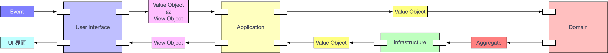

# Flyme Framework

> 基于领域驱动设计思想, 解决软件核心复杂性问题.

[TOC]

## 简介

领域驱动设计围绕着领域模型进行设计, 通过 **分层架构将领域独立出来**. 表示领域模型的对象包括: **实体, 值对象和领域服务, 领域逻辑都应该封装在这些对象中**. 这一严格的设计原则可以避免业务逻辑渗透到领域层之外, 导致技术实现与业务逻辑的混淆.

## 架构图 ( Layered Architecture )


## 目录结构

```shell
lib
├── shared.anticorruption																			# 防腐层
│   ├── adapter																								# 适配器
│   │   └── adapter.dart
│   ├── shared.anticorruption.dart
│   ├── assemble																							# 装配器
│   │   └── assemble.dart
│   └── translator																						# 翻译器
│       └── translator.dart
├── shared.application																				# 应用层
│   ├── shared.application.dart
│   ├── service																								# 应用服务
│   │   └── service.dart
│   └── use_case																							# 业务用例
│       └── use_case.dart
├── common																										# 全局公共
│   ├── app
│   │   ├── app_component.dart
│   │   ├── app_provider.dart
│   │   ├── app_routes.config.dart
│   │   ├── app_routes.dart
│   │   ├── shared.application.dart
│   │   └── shared.application.iconfig.dart
│   ├── component																							# 公共组件
│   │   ├── app_title
│   │   │   └── app_title.dart
│   │   ├── async_loader
│   │   │   └── async_loader.dart
│   │   ├── component.dart
│   │   ├── dialog
│   │   │   └── dialog.dart
│   │   ├── page
│   │   │   └── not_found_page.dart
│   │   ├── responsive_widget
│   │   │   ├── responsive_widget.dart
│   │   │   └── size_config.dart
│   │   └── widget																						# 公共基础控件
│   │       └── widget.dart
│   ├── config																								# 配置文件
│   │   ├── config.dart
│   │   └── theme																							# 主题配置
│   │       └── theme.dart
│   ├── provider																							# 自定义 Provider
│   │   ├── model_provider.dart
│   │   ├── model_provider_selector.dart
│   │   └── view_model																				# ViewModel 基类
│   │       └── view_model.dart
│   ├── service																								# 基础服务
│   │   ├── db_service.dart
│   │   ├── network_service.dart
│   │   └── service.dart
│   └── utils																									# 常用工具类
│       ├── function
│       │   ├── functional.dart
│       │   └── string.dart
│       ├── http
│       │   ├── http_exception.dart
│       │   └── http_request.dart
│       ├── log
│       │   ├── dio_logger.dart
│       │   └── logger.dart
│       ├── stroage
│       │   └── sp_utils.dart
│       └── utils.dart
├── shared.domain																							# 领域层
│   ├── factory																								# 工厂
│   │   └── factory.dart
│   ├── model																									# 领域模型
│   │   ├── aggregate.dart																		# 聚合
│   │   ├── domain_event.dart																	# 领域事件
│   │   ├── domain_event_publisher.dart												# 领域发布器
│   │   ├── domain_event_subscriber.dart											# 领域订阅器
│   │   ├── entity.dart																				# 实体
│   │   └── value_object.dart																	# 值对象
│   ├── repository																						# 数据源 - 接口
│   │   └── repository.dart
│   ├── service																								# 领域服务
│   │   └── service.dart
│   └── validator																							# 领域验证器
│       ├── error
│       │   └── error.dart
│       ├── failure
│       │   ├── failure.dart
│       │   └── failure.freezed.dart
│       ├── validator.dart
│       └── value_validators.dart
├── feature																										# 新特性 (业务模块)
│   └── auth
│       ├── shared.application
│       │   ├── service
│       │   │   └── service.dart
│       │   └── use_case
│       │       └── use_case.dart
│       ├── shared.domain
│       │   ├── model
│       │   │   ├── aggregate
│       │   │   ├── entity
│       │   │   ├── event
│       │   │   ├── service
│       │   │   └── value_object
│       │   ├── repository
│       │   │   ├── auth_repository.dart
│       │   │   └── repository.dart
│       │   ├── service
│       │   │   └── service.dart
│       │   └── validator
│       │       ├── error
│       │       │   └── error.dart
│       │       ├── failure
│       │       │   └── failure.dart
│       │       ├── validator.dart
│       │       └── value_validators.dart
│       ├── shared.infrastructure
│       │   ├── data_source
│       │   │   ├── local
│       │   │   │   └── auth_local.dart
│       │   │   └── remote
│       │   │       └── auth_remote.dart
│       │   ├── model
│       │   │   └── model.dart
│       │   └── repository
│       │       └── repository.dart
│       └── user_interface
│           ├── component
│           │   ├── component.dart
│           │   └── widget
│           │       └── widget.dart
│           ├── page
│           │   ├── auth_page.dart
│           │   └── page.dart
│           └── view_model
│               ├── auth_view_model.dart
│               ├── auth_view_model.g.dart
│               └── view_model.dart
├── generated																									# 国际化相关 (自动生成)
│   ├── intl
│   │   ├── messages_all.dart
│   │   ├── messages_en.dart
│   │   └── messages_zh.dart
│   └── l10n.dart
├── shared.infrastructure																			# 基础设施层
│   ├── data_source																						# 数据源
│   │   ├── data_source.dart
│   │   ├── local																							# 本地数据源
│   │   │   └── local.dart
│   │   └── remote																						# 远程数据源
│   │       └── remote.dart
│   ├── shared.infrastructure.dart
│   ├── model																									# 数据模型
│   │   ├── dto																								# DTO
│   │   │   ├── user_octocat_dto.dart
│   │   │   ├── user_octocat_dto.freezed.dart
│   │   │   └── user_octocat_dto.g.dart
│   │   ├── model.dart
│   │   └── model.g.dart
│   └── repository																						# 资源库 - 实现
│       └── repository.dart
├── l10n																											# 国际化相关
│   ├── intl_en.arb
│   └── intl_zh.arb
├── main.dart																									# 程序入口
└── user_interface																						# 用户接口层
    ├── global																								# 全局 ViewModel 配置
    │   ├── locale_model.dart
    │   ├── locale_model.g.dart
    │   ├── theme_model.dart
    │   └── theme_model.g.dart
    ├── introduction																					# 引导页
    ├── splash																								# 启动页
    │   └── splash_page.dart
    ├── tab																										# tab 页
    │   ├── home
    │   │   ├── component																			# 私有模块中的组件
    │   │   │   ├── component.dart
    │   │   │   └── widget																		# 私有模块中的基础控件
    │   │   │       └── widget.dart
    │   │   ├── page																					# UI 界面
    │   │   │   ├── page.dart
    │   │   │   └── second.dart
    │   │   └── view_model																		# ViewModel - 界面的数据来源与事件绑定
    │   │       ├── home_view_model.dart
    │   │       ├── home_view_model.g.dart
    │   │       └── view_model.dart
    │   └── tab_container.dart
    └── user_interface.dart
```

## 架构分层

> 主要分为: 用户接口层, 应用层, 领域层, 基础设施层.

### 用户接口层

主要职责: **用户界面展示, 收集用户录入信息, 接收用户事件**.

* **page**: 用于界面展示.
* **view_model**: 用于接收用户事件.

### 应用层

> 应用层是领域模型的直接客户.

主要职责: 通过执行 **用例流**, 向 **用户接口层** 传递数据.

应用层主要包含两个模块 (在前端领域中, 应用服务等同于业务用例):

* **service**: 应用服务. 应用服务负责用例流的任务协调, 每个用例流对应一个服务方法.
* **use_case**: 业务用例. 同上.

### 领域层

DDD 中的核心层. 执行特定领域的业务逻辑.

判断一系列交互是否属于领域层的一种方法是问: "**这是否总是会发生?**" 或 "**这些步骤是分不开的吗?**".

### 基础设施层

保存聚合实例.

#### 防腐层

用于转换通信协议, 保持内部代码稳定性, 防止代码加速腐化.

## 最佳实践

### 执行流水线



1. **User Interface** 层接收到用户事件, 将事件封装成 **View Object** 或 **Value Object**, 传输到 **Application** 层.

2. **Application** 层通过传输过来的 **VO** 对象, 组装成对应的 **Aggregate**, 调用 **Aggregate** 的方法, 执行 **Aggregate** 内部的校验规则, 执行 **Aggregate** 中的业务逻辑.

3. 将校验后的结果, 传输到 **infrastructure** 层, **infrastructure** 层将传递过来的 **Aggregate** 对象进行存储 ( 网络请求 ), 同时返回 **Value Object**.
4. **Application** 层将 **infrastructure** 层返回的 **Value Object** 转换为相应的 **View Object**, 再返回给 **User Interface** 层.
5. **User Interface** 层直接展示 **Application** 层返回的 **View Object**.

### 命名规范

文件统一使用 **小写字母+下划线** 命名.

所有变量命名统一使用 **小驼峰** 命名.

尽量使用私有变量.

尽量使用 **const** 构造函数.

### 代码示例


## 自动化测试

### 单元测试

执行单元测试的代码在 **test** 文件夹下.

执行单元测试命令:

```shell
# 执行指定的单元测试文件
flutter test test/unit_test.dart
# 执行所有测试
flutter test
```

### 集成测试

集成测试的代码在 **test_driver** 文件夹下.

执行集成测试命令:

```shell
flutter drive --target=test_driver/app.dart --keep-app-running
```

## 相关工具

#### 代码模板 - Flyme

##### 安装方法

* Android Studio: 打开偏好设置, 在 **Plugins Marketplace** 中搜索  **Flyme** 插件, 安装后重新启动即可.
* VS Code: 在扩展面板中, 搜索 **Flyme Snippet** 插件, 直接安装即可.

##### 使用方法

详情请见 **Flyme Snippet** 使用文档.

[Flyme Snippet for Android Studio](https://github.com/maybewaityou/idea-flyme-plugin)

[Flyme Snippet for VS Code](https://github.com/maybewaityou/flyme-snippet)

### 代码生成器 - generator-flyme

##### 安装方法

```shell
npm install -g yo
npm install -g generator-flyme
# 如果没有权限, 请使用以下命令
sudo npm install -g yo
sudo npm install -g generator-flyme
```

##### 使用方法

详情请见 generator-flyme 使用文档.

## 扩展知识

[Domain-Driven-Design 相关概念](https://github.com/maybewaityou/flyme_ddd/blob/master/README.md)

[四色原型建模]()

[DCI 架构 (Data Context Interactions)]()

