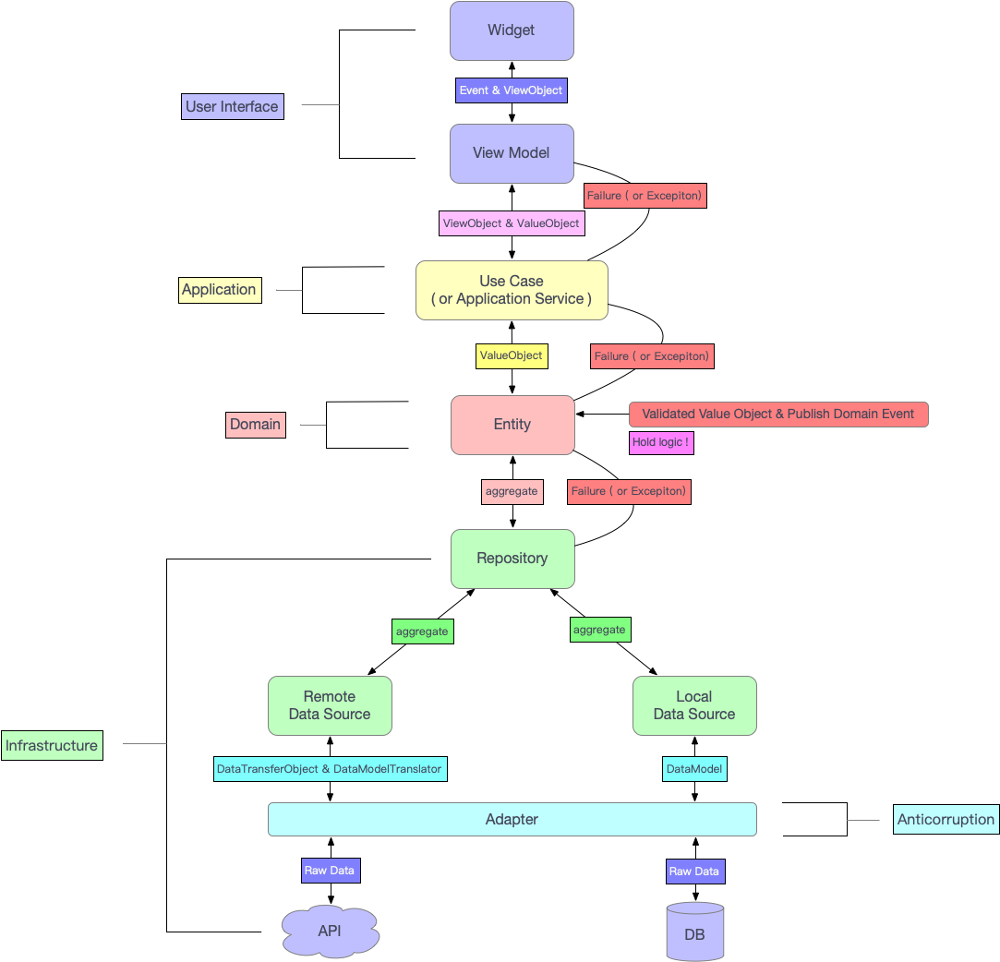

# Flyme Framework

> 基于领域驱动设计思想.

[TOC]

## 架构图



## 目录结构

```shell
lib
├── shared.anticorruption																						# 防腐层
│   ├── adapter																								# 适配器
│   │   └── adapter.dart
│   ├── shared.anticorruption.dart
│   ├── assemble																							# 装配器
│   │   └── assemble.dart
│   └── translator																						# 翻译器
│       └── translator.dart
├── shared.application																								# 应用层
│   ├── shared.application.dart
│   ├── service																								# 应用服务
│   │   └── service.dart
│   └── use_case																							# 业务用例
│       └── use_case.dart
├── common																										# 全局公共
│   ├── app
│   │   ├── app_component.dart
│   │   ├── app_provider.dart
│   │   ├── app_routes.config.dart
│   │   ├── app_routes.dart
│   │   ├── shared.application.dart
│   │   └── shared.application.iconfig.dart
│   ├── component																							# 公共组件
│   │   ├── app_title
│   │   │   └── app_title.dart
│   │   ├── async_loader
│   │   │   └── async_loader.dart
│   │   ├── component.dart
│   │   ├── dialog
│   │   │   └── dialog.dart
│   │   ├── page
│   │   │   └── not_found_page.dart
│   │   ├── responsive_widget
│   │   │   ├── responsive_widget.dart
│   │   │   └── size_config.dart
│   │   └── widget																						# 公共基础控件
│   │       └── widget.dart
│   ├── config																								# 配置文件
│   │   ├── config.dart
│   │   └── theme																							# 主题配置
│   │       └── theme.dart
│   ├── provider																							# 自定义 Provider
│   │   ├── model_provider.dart
│   │   ├── model_provider_selector.dart
│   │   └── view_model																				# ViewModel 基类
│   │       └── view_model.dart
│   ├── service																								# 基础服务
│   │   ├── db_service.dart
│   │   ├── network_service.dart
│   │   └── service.dart
│   └── utils																									# 常用工具类
│       ├── function
│       │   ├── functional.dart
│       │   └── string.dart
│       ├── http
│       │   ├── http_exception.dart
│       │   └── http_request.dart
│       ├── log
│       │   ├── dio_logger.dart
│       │   └── logger.dart
│       ├── stroage
│       │   └── sp_utils.dart
│       └── utils.dart
├── shared.domain																										# 领域层
│   ├── factory																								# 工厂
│   │   └── factory.dart
│   ├── model																									# 领域模型
│   │   ├── aggregate.dart																		# 聚合
│   │   ├── domain_event.dart																	# 领域事件
│   │   ├── domain_event_publisher.dart												# 领域发布器
│   │   ├── domain_event_subscriber.dart											# 领域订阅器
│   │   ├── entity.dart																				# 实体
│   │   └── value_object.dart																	# 值对象
│   ├── repository																						# 数据源 - 接口
│   │   └── repository.dart
│   ├── service																								# 领域服务
│   │   └── service.dart
│   └── validator																							# 领域验证器
│       ├── error
│       │   └── error.dart
│       ├── failure
│       │   ├── failure.dart
│       │   └── failure.freezed.dart
│       ├── validator.dart
│       └── value_validators.dart
├── feature																										# 新特性 (业务模块)
│   └── auth
│       ├── shared.application
│       │   ├── service
│       │   │   └── service.dart
│       │   └── use_case
│       │       └── use_case.dart
│       ├── shared.domain
│       │   ├── model
│       │   │   ├── aggregate
│       │   │   ├── entity
│       │   │   ├── event
│       │   │   ├── service
│       │   │   └── value_object
│       │   ├── repository
│       │   │   ├── auth_repository.dart
│       │   │   └── repository.dart
│       │   ├── service
│       │   │   └── service.dart
│       │   └── validator
│       │       ├── error
│       │       │   └── error.dart
│       │       ├── failure
│       │       │   └── failure.dart
│       │       ├── validator.dart
│       │       └── value_validators.dart
│       ├── shared.infrastructure
│       │   ├── data_source
│       │   │   ├── local
│       │   │   │   └── auth_local.dart
│       │   │   └── remote
│       │   │       └── auth_remote.dart
│       │   ├── model
│       │   │   └── model.dart
│       │   └── repository
│       │       └── repository.dart
│       └── user_interface
│           ├── component
│           │   ├── component.dart
│           │   └── widget
│           │       └── widget.dart
│           ├── page
│           │   ├── auth_page.dart
│           │   └── page.dart
│           └── view_model
│               ├── auth_view_model.dart
│               ├── auth_view_model.g.dart
│               └── view_model.dart
├── generated																									# 国际化相关 (自动生成)
│   ├── intl
│   │   ├── messages_all.dart
│   │   ├── messages_en.dart
│   │   └── messages_zh.dart
│   └── l10n.dart
├── shared.infrastructure																						# 基础设施层
│   ├── data_source																						# 数据源
│   │   ├── data_source.dart
│   │   ├── local																							# 本地数据源
│   │   │   └── local.dart
│   │   └── remote																						# 远程数据源
│   │       └── remote.dart
│   ├── shared.infrastructure.dart
│   ├── model																									# 数据模型
│   │   ├── dto																								# DTO
│   │   │   ├── user_octocat_dto.dart
│   │   │   ├── user_octocat_dto.freezed.dart
│   │   │   └── user_octocat_dto.g.dart
│   │   ├── model.dart
│   │   └── model.g.dart
│   └── repository																						# 资源库 - 实现
│       └── repository.dart
├── l10n																											# 国际化相关
│   ├── intl_en.arb
│   └── intl_zh.arb
├── main.dart																									# 程序入口
└── user_interface																						# 用户接口层
    ├── global																								# 全局 ViewModel 配置
    │   ├── locale_model.dart
    │   ├── locale_model.g.dart
    │   ├── theme_model.dart
    │   └── theme_model.g.dart
    ├── introduction																					# 引导页
    ├── splash																								# 启动页
    │   └── splash_page.dart
    ├── tab																										# tab 页
    │   ├── home
    │   │   ├── component																			# 私有模块中的组件
    │   │   │   ├── component.dart
    │   │   │   └── widget																		# 私有模块中的基础控件
    │   │   │       └── widget.dart
    │   │   ├── page																					# UI 界面
    │   │   │   ├── page.dart
    │   │   │   └── second.dart
    │   │   └── view_model																		# ViewModel - 界面的数据来源与事件绑定
    │   │       ├── home_view_model.dart
    │   │       ├── home_view_model.g.dart
    │   │       └── view_model.dart
    │   └── tab_container.dart
    └── user_interface.dart
```

## 架构分层

> 主要分为: 用户接口层, 应用层, 领域层, 基础设施层.

### 用户接口层

主要职责: **用户界面展示, 收集用户录入信息, 接收用户事件.**

* **page**: 用于界面展示.
* **view_model**: 用于接收用户事件.

### 应用层

> 应用层是领域模型的直接客户.

主要职责: 通过执行用例流, 向 **用户接口层** 传递数据.

应用层主要包含两个模块 (在前端领域中, 应用服务等同于业务用例):

* **service**: 应用服务. 应用服务负责用例流的任务协调, 每个用例流对应一个服务方法.
* **use_case**: 业务用例. 同上.

用户界面渲染数据的方式:

* 渲染领域对象: 渲染 **Domain** 对象.
* 渲染数据传输对象: 渲染 **DTO** 对象.
* 使用调停者发布聚合的内部状态: **Callback** 方式, 获取聚合内部状态.
* 通过领域负载对象渲染聚合实例: 渲染 **DPO ( Domain Payload Object )** 对象, 类似于渲染 **DTO** 对象.
* 聚合实例的状态展现: 根据用例来创建 **视图模型 ( View Object )** 或 **展现模型 (Persentation Model)**.
* 用例优化资源库查询: 在 **资源库 ( Repository )** 中创建一些查询方法, 这些方法返回的是所有聚合实例属性的超集. 查询方法动态的将查询结果放在一个 **值对象 ( Value Object)** 中, 该 **值对象 ( Value Object)** 是特别为当前用例设计的, 这个用例优化的 **值对象 ( Value Object)** 将被直接用于渲染用户界面.

### 领域层


### 基础设施层


#### 防腐层


## 最佳实践


## DDD 相关概念

### 领域, 子域和界限上下文

### 实体

### 值对象

### 领域服务

### 领域事件

### 模块

### 聚合

### 工厂

### 资源库

### 集成界限上下文

### 应用程序


